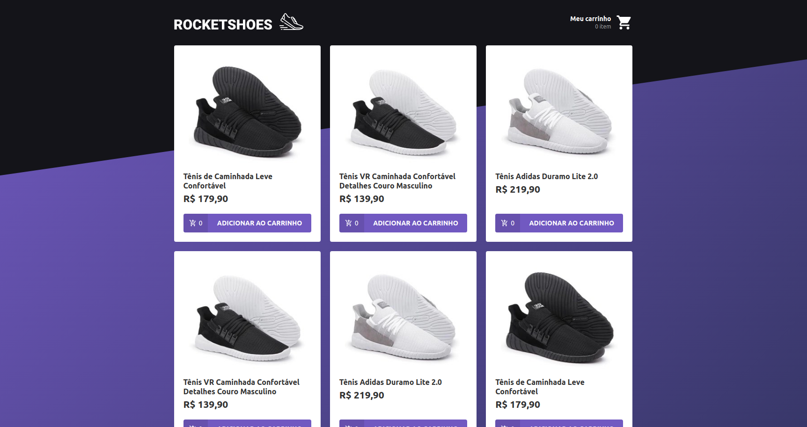
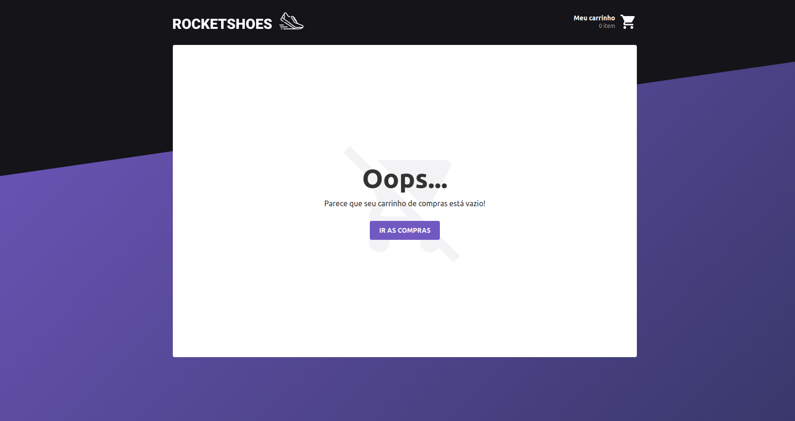
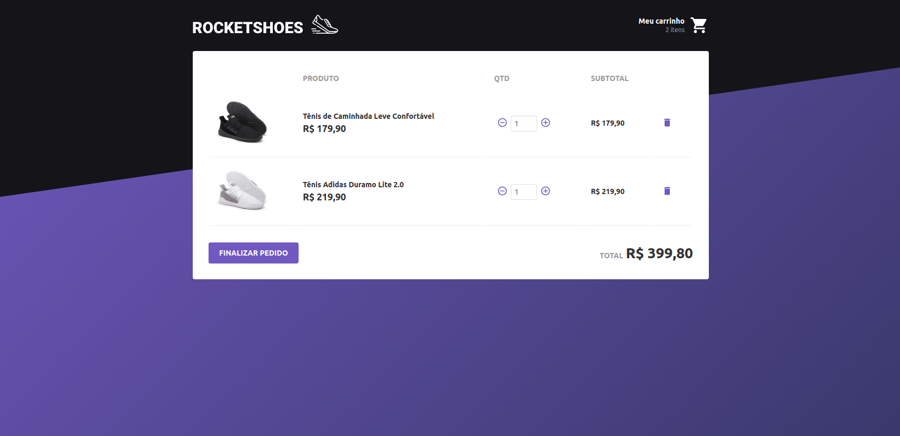

<h3 align="center">
  NetShoes Clone App with React and Redux.
</h3>

<p align="center">
  

  

  
  <a href="https://github.com/tiagoalmeida93/react-rocketshoes/commits/master">
    
  </a>

  <a href="https://github.com/tiagoalmeida93/Rocketshoes/issues">
    
  </a>

  
</p>

<p align="center">
  <a href="#rocket-technologies">Technologies</a>&nbsp;&nbsp;&nbsp;|&nbsp;&nbsp;&nbsp;
  <a href="#information_source-how-to-use">How To Use</a>&nbsp;&nbsp;&nbsp;|&nbsp;&nbsp;&nbsp;
  <a href="#memo-license">License</a>
</p>

<h2 align="center">Home</h2>



<h2 align="center">Cart Clear</h2>



<h2 align="center">Cart with Products</h2>



<h3 align="center">Demo on</h3>
<p align="center">
  <a href="https://tiago-rocketshoes.netlify.com/" target="_blank">
    
  </a>
</p>

## :rocket: Technologies

This project was developed at the [RocketSeat GoStack Bootcamp](https://rocketseat.com.br/bootcamp) with the following technologies:

-  [ReactJS](https://reactjs.org/)
-  [Redux](https://redux.js.org/)
-  [Redux-Saga](https://redux-saga.js.org/)
-  [React Router v4](https://github.com/ReactTraining/react-router)
-  [Axios](https://github.com/axios/axios)
-  [History](https://www.npmjs.com/package/history)
-  [Immer](https://github.com/immerjs/immer)
-  [Polished](https://polished.js.org/)
-  [React-Toastify](https://fkhadra.github.io/react-toastify/)
-  [styled-components](https://www.styled-components.com/)
-  [React-Icons](https://react-icons.netlify.com/)
-  [react-loading-skeleton](https://github.com/dvtng/react-loading-skeleton)
-  [react-loader-spinner](https://github.com/mhnpd/react-loader-spinner)
-  [json-server](https://github.com/typicode/json-server)
-  [Reactotron](https://infinite.red/reactotron)
-  [VS Code][vc] with [EditorConfig][vceditconfig] and [ESLint][vceslint]

## :information_source: How To Use

To clone and run this application, you'll need [Git](https://git-scm.com), [Node.js v10.16][nodejs] or higher + [Yarn v1.13][yarn] or higher installed on your computer. From your command line:

```bash
# Clone this repository
$ git clone https://github.com/tiagoalmeida93/Rocketshoes

# Go into the repository
$ cd Rocketshoes

# Install dependencies
$ yarn install

# Run the app
$ yarn start
```
